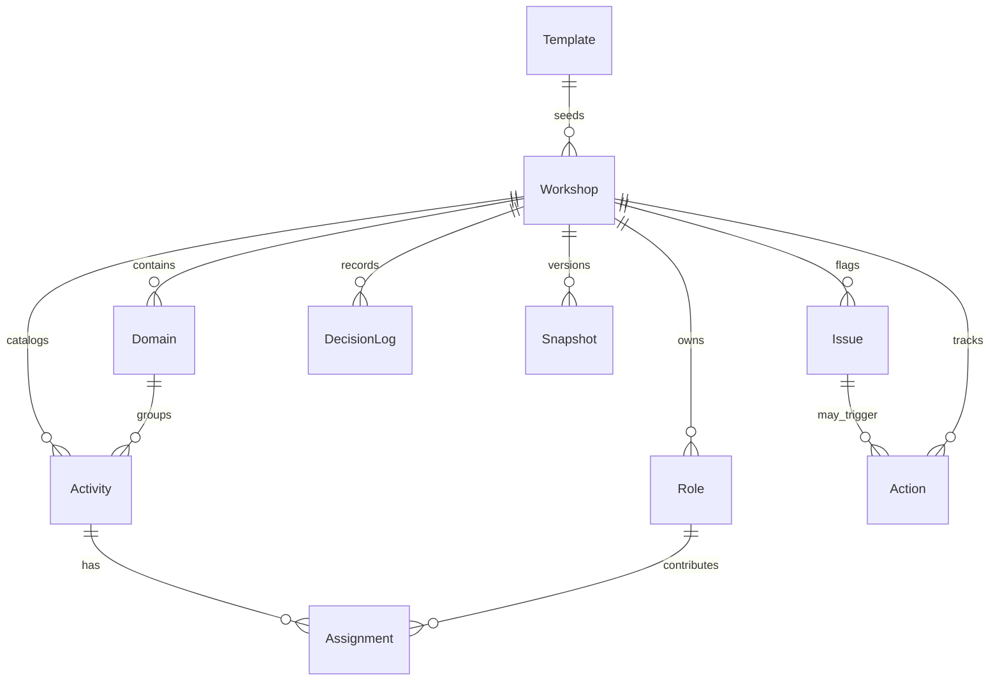

# OT RACI Workshop Assistant — Product Definition & Implementation (PDI)

## Project overview + goals
A self-hosted facilitator tool that turns the canonical OT RACI Excel into a guided workshop experience. The goals are to:
- Ingest the canonical workbook as the source of truth for domains, activities, and role headers.
- Drive an A-first wizard that elicits and confirms R/A/C/I decisions from leadership (no auto-guessing).
- Validate coverage live, capture parking-lot items, and convert gaps into actionable follow-ups.
- Export executive-ready outputs (filled Excel, CSV bundle, PPTX/PDF pack) plus JSON snapshots for audit.

## How Excel import works (sheet parsing rules)
- Upload endpoint: `POST /api/templates/upload` accepts base64 XLSX; file is persisted to `data/uploads`.
- Parser iterates sheets ending with `raci` (case-insensitive):
  - Detects the first header row containing any non-empty cells after column A; those cells become **Roles** (with column indexes and domain binding to the sheet).
  - Column A drives hierarchy: an isolated value becomes the current **Section**; subsequent rows with text in column A and optional R/A/C/I marks become **Activities** under the sheet/domain.
  - Each populated R/A/C/I cell is captured as a recommended starting assignment and its `(row, column)` coordinates for round-tripping.
- `Instructions*` sheets are concatenated into guidance text; `Lists*` sheets become drop-down sources.
- Parsed payload stored with SHA-256 file hash, domains, roles, activities (with cell map), instructions, and lists for later export fidelity.

## How wizard mode works (A-first)
- Wizard steps: select org/workshop → upload Excel → choose in-scope domains → run domain walkthrough → review issues → export executive pack.
- For each activity, the wizard prompts in order: **Accountable** (single select, required), **Responsible** (multi-select), **Consulted**, **Informed**.
- Recommended answers from Excel are shown but require explicit confirmation. Facilitator can mark an item for parking lot with owner/due date.
- Decision logging: submissions can be written to the `decision_logs` table (API-ready) for who decided and when.

## Validation rules catalog
- Exactly one **A** per activity (critical) → `missing_A` or `too_many_A` issues.
- At least one **R** per activity (critical) → `missing_R` issue.
- Communication gap warning when R exists without any I → `communication_gap` issue.
- Rules are enforced via `POST /api/workshops/{id}/validate`; results persisted as Issue rows with recommendations for remediation.

## Export formats + executive pack definition
- **Excel**: fills the original workbook structure using captured cell coordinates; appends `Outputs` sheet with metadata and timestamp.
- **CSV bundle**: action register export via `POST /api/workshops/{id}/export/actions` (description, owner, due, status, linked issue).
- **PPTX/PDF**: generated through `POST /api/workshops/{id}/export/pptx` and `/export/pdf` with summary placeholders (completion %, issues) and saved to `data/exports`.
- **Snapshot JSON**: `POST /api/workshops/{id}/snapshot` captures domains, roles, activities, assignments, issues, and actions for audit/versioning.

## Runbook (local + docker)
- **Local API**
  ```bash
  pip install -r requirements.txt
  uvicorn backend.main:app --reload
  # open http://localhost:8000
  ```
- **Docker Compose**
  ```bash
  docker compose up --build
  # backend exposed on 8000
  ```
- Data directories: SQLite under `data/`, uploads in `data/uploads`, exports in `data/exports`.

## Data model diagram (mermaid)


## API contract (endpoints + payloads)
- `GET /api/health` → `{status:"ok"}`.
- `POST /api/templates/upload` → Template metadata + parsed domains/roles/activities.
- `POST /api/workshops` → create workshop from template (org/workshop names).
- `GET /api/workshops` → list workshops.
- `GET /api/workshops/{id}/domains|roles|activities` → scoped catalog for wizard/matrix.
- `PUT /api/workshops/{id}/assignments/bulk` → `{domain_id, assignments:[{activity_id, role_id, raci_value}]}`.
- `GET /api/workshops/{id}/progress` → completion stats.
- `POST /api/workshops/{id}/validate` → persists issues with severity/recommendations.
- `GET /api/workshops/{id}/actions` → list action register; `POST /api/workshops/{id}/actions/generate` converts open issues to actions.
- Exports: `/export/excel`, `/export/pdf`, `/export/pptx`, `/export/actions`, `/snapshot`.

## UX flows (step-by-step)
1. Dashboard (`/`): start wizard, view progress tiles (domains loaded, completion %, open issues/actions), quick resume.
2. Wizard setup: select organization/workshop or create new; upload canonical Excel; confirm detected domains/roles/activities.
3. Scope: pick domains for this session; defer others.
4. Guided decisions: A-first prompts, recommended seeds, validation banners, parking-lot capture.
5. Matrix editor: grid view for rapid edits; filters for missing A/R and notes per cell.
6. Issues & Actions: validate, convert issues to actions, manage parking lot with owner/due dates.
7. Reports: heatmaps and executive narrative blocks; trigger PPTX/PDF exports.

## Acceptance tests checklist
- Upload Excel parses domains, roles, activities, and instructions without altering sheet order.
- Workshop creation seeds domain/role/activity records tied to template.
- Validation fails when Accountable missing or multiple; surfaces communication gaps.
- Issue-to-action conversion creates actionable rows with linked issue references.
- Excel export preserves original sheet/column layout and fills confirmed assignments at stored coordinates; Outputs sheet stamped with workshop metadata.
- PPTX/PDF endpoints respond with generated files; CSV actions export lists owners/dates/status.
- Snapshot endpoint returns and stores serialized workshop state for offline audit.
